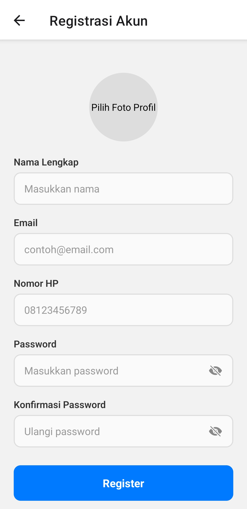
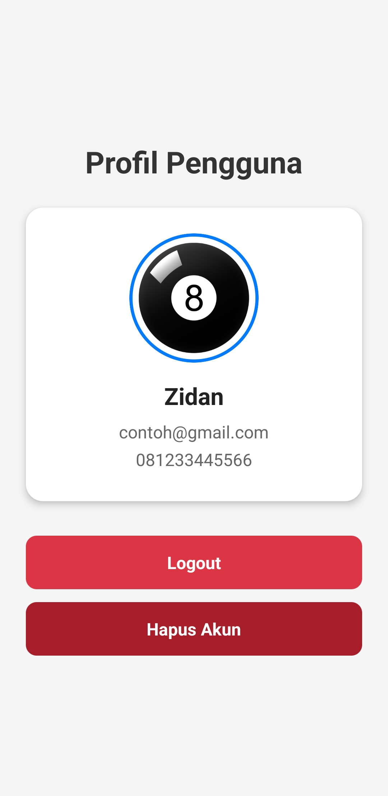

# React Native Form Validation & Authentication

## Informasi Mahasiswa

- Nama : Muhamad Zidan Rabani
- NIM : 2410501036

## Deskripsi Aplikasi

Aplikasi ini adalah implementasi antarmuka Form Login, Registrasi, dan Profil berbasis seluler (React Native dan Expo) pada pengelolaan (*state*) *form* dan validasi *client-side* yang komprehensif, proyek ini mendemonstrasikan perpaduan fungsional library **Formik**, **Yup**, dan **AsyncStorage** untuk mensimulasikan kelancaran autentikasi data pengguna mulai dari nol hingga level lanjut (UX yang baik).

## Fitur yang Diimplementasikan

- **Validasi Sinkronus Skema Yup**: 
  Setiap *field* input di halaman Login maupun Registrasi (Nama, Email, No. HP, Password, dan Konfirmasi) dicegah dari kesalahan manipulasi menggunakan *Schema* proteksi dari library Yup.
- **Form Custom UI Interaktif**:
  Memanfaatkan turunan Custom Component bernama `FormInput`, kotak input akan memberikan *feedback visual* berubah warna merah serta memunculkan pesan spesifik jika terjadi kesalahan nilai (seperti salah perpaduan karakter/format email).
- **Indikator Keamanan Password**: 
  Memiliki fitur tambahan untuk mendeteksi seberapa kuat password pengguna yang sedang diketik secara *real-time* (memunculkan label *Weak*, *Medium*, atau *Strong*).
- **Otomasi Navigasi Keyboard**:
  - Kolom isian dapat diarahkan ke baris berikutnya secara otomatis berkat implementasi `forwardRef` pada *keyboard virtual*.
  - Menggunakan layar khusus `KeyboardAvoidingView` agara *form* tidak bertumpuk/tertutupi saat *keyboard smartphone* aktif.
- **Upload Poto Profil & AsyncStorage**:
  Aplikasi ini memanfaatkan *Expo Image Picker* demi mendapatkan galeri lokal, di mana info data pengguna (serta sesi foto mereka) disimpan secara independen tanpa peladen/server alias *offline-ready* memakai **AsyncStorage**.
- **Aksi Logout & Hapus Akun Otomatis**:
  Mampu mereset navigasi dan dengan aman menghabiskan profil registrasi dari sistem lokal ketika pengguna mendesak aksi Hapus Akun.

## Screenshot

### Halaman Registrasi (Validasi Form Input)
<p align="center">
  <!-- Ganti gambar dengan screenshot asli aplikasi Anda -->
  
</p>

### Halaman Login Default
<p align="center">
  <!-- Ganti gambar dengan screenshot asli aplikasi Anda -->
  
</p>

### Halaman Profil Beranda (Sesudah Registrasi)
<p align="center">
  <!-- Ganti gambar dengan screenshot asli aplikasi Anda -->
  
</p>

## Cara Menjalankan

```bash
npm install && npx expo start
```